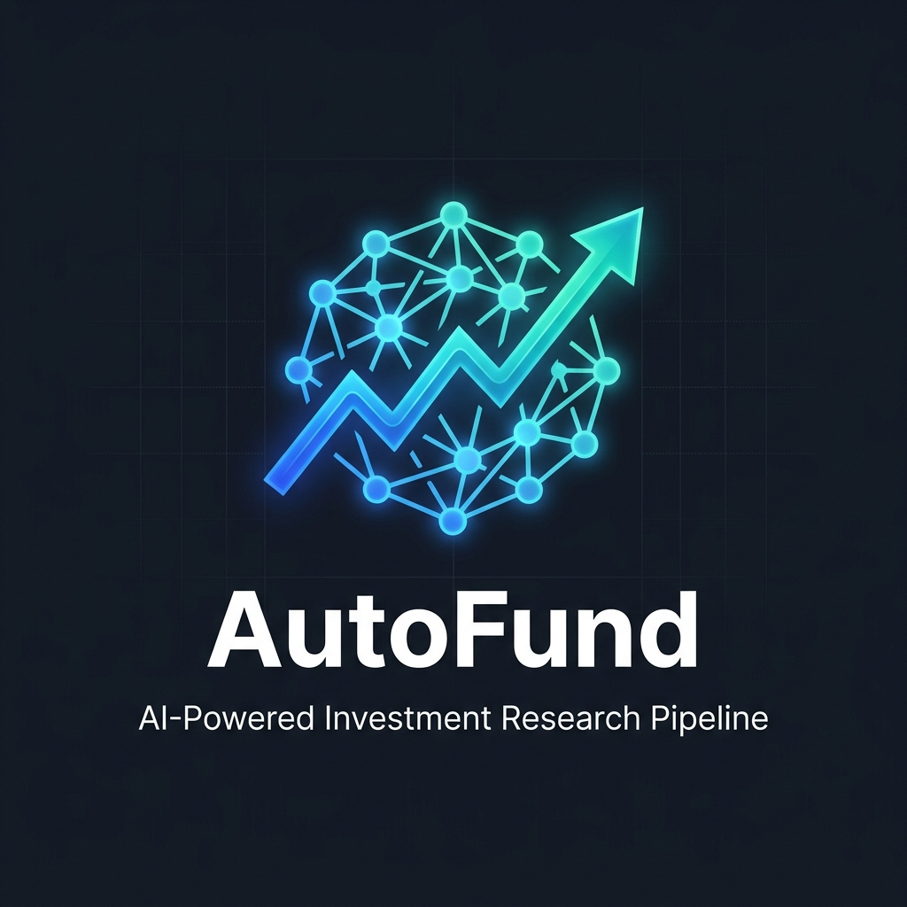

<p align="center">
  
</p>

<h1 align="center">AutoFund</h1>

<p align="center">
  <strong>A digital investment fund run entirely by AI agents.</strong><br>
  Agents read the news, analyze markets, build scenarios, make decisions, and trade &mdash; autonomously.
</p>

<p align="center">
  
  
  
  
  
  
</p>

---

## What Is This?

AutoFund is an **autonomous investment research and paper-trading system** where every stage of the investment process — from reading the morning news to placing a trade — is handled by specialized AI agents.

No real money is involved. The fund trades on a simulated portfolio using **live market prices** from Yahoo Finance, so the results are realistic, but the risk is zero.

Here's the idea in plain English:

1. **An Economist** reads macroeconomic news and writes a market briefing every morning
2. **A Researcher** scrapes financial headlines and spots investment opportunities
3. **An Analyst** pulls real market data and runs financial models (DCF, technicals, peer comparisons)
4. **Three Associates** each independently write bull, bear, and base-case scenarios
5. **A Manager** reads everything, makes the final call, and executes the trade with structured sell conditions
6. **A Monitor** watches every open position 24/7 and automatically sells when conditions are met

All of this runs with a single command.

---

## How It Works

```
                  ┌──────────────────────────────────────────────────────┐
                  │              DAILY RESEARCH PIPELINE                 │
                  │                                                      │
                  │   Economist ──→ Macro Briefing                       │
                  │       ↓                                              │
                  │   Researcher ──→ Opportunity Scan (Yahoo Finance)    │
                  │       ↓                                              │
                  │   Analyst ──→ DCF · Technicals · Peer Comparison     │
                  │       ↓                                              │
                  │   3 Associates ──→ Bull / Base / Bear Scenarios      │
                  │       ↓                                              │
                  │   Manager ──→ BUY / SELL / HOLD + Sell Conditions    │
                  └──────────────────────────────────────────────────────┘

                  ┌──────────────────────────────────────────────────────┐
                  │              CONTINUOUS MONITORING                    │
                  │                                                      │
  Every 30 min    │   Monitor ──→ Check sell conditions on all positions │
                  │            ──→ Auto-sell if triggered & market open  │
                  └──────────────────────────────────────────────────────┘
```

Each agent talks to an LLM (via [OpenRouter](https://openrouter.ai)), has its own system prompt, and has access to specific tools — the Analyst can pull market data and run financial models, the Manager can execute trades, etc.

---

## Quick Start

### Prerequisites

- **Python 3.11+** installed ([download here](https://www.python.org/downloads/))
- An **OpenRouter API key** ([sign up free](https://openrouter.ai/keys)) — this is how the agents access LLMs
- **[Obscura](https://github.com/h4ckf0r0day/obscura)** — the headless browser engine used for news scraping (a Rust CDP server that Playwright drives). See [Browser Engine](#browser-engine-obscura).
- **Git** (to clone the repo)

### 1. Clone the repository

```bash
git clone https://github.com/YOUR_USERNAME/AutoFund.git
cd AutoFund
```

### 2. Create a virtual environment (recommended)

```bash
python -m venv venv

# Windows
venv\Scripts\activate

# macOS / Linux
source venv/bin/activate
```

### 3. Install dependencies

```bash
pip install -r requirements.txt
```

### 4. Install the browser engine (for news scraping)

The Researcher agent needs a headless browser to render Yahoo Finance's JavaScript SPA. AutoFund uses **[Obscura](https://github.com/h4ckf0r0day/obscura)** — a lightweight headless browser engine written in Rust that speaks the Chrome DevTools Protocol. Install it once:

```bash
# Linux / Raspberry Pi
cargo install --git https://github.com/h4ckf0r0day/obscura obscura

# macOS
brew install obscura

# or download a release binary and put it on your PATH:
# https://github.com/h4ckf0r0day/obscura/releases
```

Check that it's reachable:

```bash
obscura serve --port 9222
```

**You do not need to run this manually** — `scraper/yfinance_scraper.py` starts the Obscura server itself before each scrape and shuts it down afterwards. If one is already listening on port `9222`, it is reused and left running. See [Browser Engine](#browser-engine-obscura) for the full explanation.

### 5. Set your API key

Copy the example file and fill in your keys:

```bash
cp .env.example .env
```

```ini
OPENROUTER_API_KEY=sk-or-v1-your-key-here
TELEGRAM_BOT_TOKEN=your-telegram-bot-token   # optional, for notifications
TELEGRAM_CHAT_ID=your-telegram-chat-id       # optional
```

`pipeline.py`, `monitor.py`, and `telegram_notifier.py` load `.env` automatically, so this works under `cron` too. `.env` is gitignored — never commit it.

You can also export the variables in your shell instead:

```bash
# Windows (Command Prompt)
set OPENROUTER_API_KEY=sk-or-v1-your-key-here

# Windows (PowerShell)
$env:OPENROUTER_API_KEY = "sk-or-v1-your-key-here"

# macOS / Linux
export OPENROUTER_API_KEY=sk-or-v1-your-key-here
```

> **Tip:** Add this to your shell profile (`.bashrc`, `.zshrc`, or PowerShell `$PROFILE`) so you don't have to set it every time.

### 6. Run the pipeline

```bash
python pipeline.py
```

That's it. The pipeline will run all five stages in order and save every agent's output to the `research/` folder. If the Manager decides to buy something, the trade appears in `trader/data/portfolio.json`.

---

## Project Structure

```
AutoFund/
│
├── pipeline.py              ← Run the daily research pipeline (Loop A)
├── runner.py                ← Cron entry point for the pipeline (skips NYSE holidays)
├── monitor.py               ← Run the sell-condition monitor (Loop B)
├── telegram_notifier.py     ← Telegram reports (pipeline result + monitor ticks)
├── requirements.txt         ← Python dependencies
├── .env.example             ← Template for your API keys
│
├── agents/                  ← LLM infrastructure
│   ├── client.py            ← OpenRouter API client (retries, provider routing)
│   ├── runner.py            ← Agent execution loop (prompt → LLM → tools → response)
│   └── tools.py             ← Tool definitions & execution handlers
│
├── analyst/                 ← Financial analysis toolkit
│   ├── market_data.py       ← Yahoo Finance data puller (CLI + Python API)
│   ├── models.py            ← Financial model library (DCF, technicals, scenarios, etc.)
│   └── interpreter.py       ← Sandboxed Python code interpreter for custom analysis
│
├── trader/                  ← Paper trading engine
│   ├── engine.py            ← Core: buy(), sell(), get_portfolio(), check_sell_conditions()
│   ├── cli.py               ← Rich CLI dashboard
│   ├── market_hours.py      ← Exchange hours + holiday/early-close calendar
│   ├── allowed_assets.py    ← Tradeable universe (US + EU stocks, commodities)
│   └── data/
│       └── portfolio.json   ← Persistent portfolio state (created on first run, gitignored)
│
├── scraper/
│   ├── yfinance_scraper.py  ← Obscura/CDP-based Yahoo Finance headline scraper
│   ├── yfinance_scraper_chrome.py  ← Same scraper on bundled Chromium (fallback)
│   └── README_YFINANCE.md   ← Scraper internals & selector reference
│
├── prompts/                 ← System prompts for each agent
│   ├── 00_researcher.md
│   ├── 01_economist.md
│   ├── 02_analyst.md
│   ├── 03a_base_associates.md
│   ├── 03b_bearish_associates.md
│   ├── 03c_bullish_associates.md
│   └── 04_manager.md
│
├── skills/                  ← Skill documents (how-to guides for agents)
│   ├── paper_trading.md
│   └── analyst_market_data.md
│
├── config/
│   └── models.json          ← Which LLM (and provider) each agent uses
│
├── research/                ← Pipeline output (one file per stage per day)
│
├── autofund.crontab         ← Cron schedule for runner.py + monitor.py
├── CRON_README.md           ← Cron configuration reference
├── CRON_INSTALL_STEPS.md    ← Step-by-step cron install & verification
│
└── tests/
    ├── test_sell_conditions.py
    ├── test_engine.py
    ├── test_pipeline_monitor.py
    ├── test_cron_monitor.py
    ├── test_analyst.py
    ├── test_allowed_assets.py
    ├── test_client_runner.py
    └── test_tools.py
```

---

## Usage Guide

### Running the Pipeline

```bash
# Run everything from scratch
python pipeline.py

# Skip to a specific stage (earlier stages are loaded from today's files)
python pipeline.py --stage analyst
python pipeline.py --stage manager

# Preview what would run without actually running
python pipeline.py --dry-run
```

The pipeline saves a dated file for each stage in `research/`:
- `economist_briefing_2026-04-21.md`
- `researcher_daily_2026-04-21.md`
- `analyst_summary_2026-04-21.md`
- `associate_base_2026-04-21.md` (and bear, bull)
- `manager_decision_2026-04-21.md`

> **Scrape resilience.** The Researcher stage retries the scraper up to 6 times and requires at least 15 articles before continuing, so a slow or partially-hydrated Yahoo page doesn't abort the day's run.

### Running the Monitor

The monitor checks whether any of your open positions have tripped their sell conditions (price targets, stop losses, P/E limits, etc.):

```bash
# Run one check and exit (good for cron jobs)
python monitor.py

# Run continuously, checking every 15 minutes
python monitor.py --loop

# Custom interval (every 5 minutes)
python monitor.py --loop --interval 5

# Run once, but only if the NYSE is actually open (holidays, weekends and
# early closes are skipped), and send a Telegram report
python monitor.py --cron
```

When a condition triggers and the market is open, the sell happens automatically. If the market is closed, the sell is queued and executes at the next open.

### Running the Cron Runner

`runner.py` is the unattended entry point. It checks the NYSE session calendar first and exits quietly on weekends and holidays, so you can schedule it unconditionally:

```bash
# Runs the full pipeline only on NYSE trading days
python runner.py

# Same, plus a Telegram summary on success and a failure alert on error
python runner.py --cron
```

### Telegram Notifications

Set `TELEGRAM_BOT_TOKEN` and `TELEGRAM_CHAT_ID` in `.env` to get push notifications. No extra code needed — the cron modes send them automatically:

| Trigger | What you receive |
|---|---|
| `runner.py --cron` finishes | ✅ Pipeline completed + trades executed today + full account summary |
| `runner.py --cron` fails | ❌ Pipeline failed, with the exception message |
| `monitor.py --cron` | 📊 Hourly monitor report: positions checked, conditions triggered/approaching, account summary |

To set it up: message [@BotFather](https://t.me/BotFather) to create a bot and get the token, then message your bot and open `https://api.telegram.org/bot<TOKEN>/getUpdates` to find your `chat_id`. If either variable is unset, notifications are silently skipped.

### Using the CLI

The CLI gives you a dashboard view of your portfolio:

```bash
# Full portfolio dashboard with live P&L
python -m trader portfolio

# Check sell conditions on all positions
python -m trader monitor

# Deep-dive into a single position
python -m trader position AAPL

# See which exchanges are open right now
python -m trader status

# Transaction history
python -m trader history

# Manual trades (for testing)
python -m trader buy AAPL 10 --reason "Testing" --force
python -m trader sell AAPL 5 --reason "Taking profit" --force

# Add a sell condition to an existing position
python -m trader add-condition AAPL \
  --type price_target \
  --target 250 \
  --operator gte \
  --reason "Sell if price hits $250"

# Reset everything
python -m trader reset --yes
```

> The `--force` flag skips the market-hours check. Without it, trades only execute when the relevant exchange is open.

---

## Browser Engine: Obscura

> **Note:** earlier versions of AutoFund drove Yahoo Finance with Playwright's bundled Chromium. AutoFund now uses **[Obscura](https://github.com/h4ckf0r0day/obscura)** as the default engine. Everything else about the pipeline is unchanged.

Yahoo Finance is a fully JavaScript-rendered single-page application, so plain HTTP clients (`requests`) only get an empty shell. The scraper needs a real browser engine to render the feed and each article.

**Obscura** is an open-source headless browser written in Rust. It runs real JavaScript on V8, speaks the Chrome DevTools Protocol, and acts as a drop-in replacement for headless Chrome with Playwright. AutoFund keeps Playwright as the *driver* and swaps out the *browser*: `scraper/yfinance_scraper.py` launches `obscura serve --port 9222`, then connects with `chromium.connect_over_cdp()`.

### Why Obscura over bundled Chromium

- **Much lighter footprint.** No ~150 MB Chromium download and no `--with-deps` system packages — useful on a Raspberry Pi.
- **Hardened against runaway pages.** A V8 watchdog kills runaway scripts, DOM operations are panic-safe, and the CDP server terminates any single command that overruns its budget, so one heavy page can't wedge the browser.
- **Tunable budgets.** Yahoo's vendor bundles are heavy enough to trip Obscura's conservative defaults, so the scraper raises them on startup (`OBSCURA_NAV_TIMEOUT_MS`, `OBSCURA_CDP_COMMAND_TIMEOUT_MS`, `OBSCURA_SCRIPT_DEADLINE_MS`, `OBSCURA_MODULE_BUDGET_MS`) — but only if you haven't already set them yourself.
- **Fewer moving parts.** Blocking scripts, stylesheets, images, fonts and media via CDP request interception cuts both bandwidth and JS work, since the feed and article text are already in Yahoo's server-rendered HTML.

### Server lifecycle

The scraper manages the server itself — you don't have to start anything:

1. On startup it probes `http://127.0.0.1:9222/json/version`.
2. If an Obscura server is already answering, it reuses it and leaves it running afterwards.
3. Otherwise it spawns `obscura serve --port 9222` (adding `--quiet` unless `OBSCURA_VERBOSE` is set) and waits up to 30 s for the CDP endpoint.
4. On exit it terminates only the server it started.

The binary is resolved in this order: `$OBSCURA_BIN` → `obscura` on `PATH` → `~/.local/bin/obscura` → a local `obscura/dist/obscura` checkout. Set `OBSCURA_BIN` if you install it somewhere unusual, and use `--port` to run on a non-default port.

### Configurable via environment

| Variable | Default in this project | Purpose |
|---|---|---|
| `OBSCURA_BIN` | auto-detected | Absolute path to the `obscura` binary |
| `OBSCURA_VERBOSE` | unset | Keep Obscura's server logs instead of adding `--quiet` |
| `OBSCURA_NAV_TIMEOUT_MS` | `60000` | Per-navigation ceiling for Yahoo's large SPA |
| `OBSCURA_CDP_COMMAND_TIMEOUT_MS` | `70000` | Per-CDP-command V8 deadline |
| `OBSCURA_SCRIPT_DEADLINE_MS` | `60000` | Scripted fetch/XHR and module-load bound |
| `OBSCURA_MODULE_BUDGET_MS` | `10000` | Enhancement-module budget |

### Running the scraper directly

```bash
# Start Obscura, scrape, write yahoo_finance_articles_<timestamp>.json, stop Obscura
python scraper/yfinance_scraper.py

# Limit to 5 articles / custom output / custom port
python scraper/yfinance_scraper.py --max 5
python scraper/yfinance_scraper.py -o data/latest.json
python scraper/yfinance_scraper.py --port 9333
```

### Using bundled Chromium instead

If you'd rather not install Obscura, `scraper/yfinance_scraper_chrome.py` is the earlier Playwright-only version that launches Playwright's bundled Chromium. Run `python -m playwright install chromium` first, then swap the import in `agents/tools.py:_run_scraper` to point at that file.

See [scraper/README_YFINANCE.md](scraper/README_YFINANCE.md) for the selector reference, output format and troubleshooting.

---

## Sell Conditions

One of AutoFund's key features is **structured, automated sell conditions**. When the Manager buys a stock, it also sets rules for when to sell. These are monitored continuously.

### Condition Types

| Type | What It Checks | Example |
|---|---|---|
| `price_target` | Current market price | "Sell if price ≥ $240" |
| `pnl_pct` | Unrealized profit/loss % | "Sell if P&L ≤ −10% (stop loss)" |
| `trailing_stop` | Drawdown from peak price | "Sell if price drops 5% from its high" |
| `weight_pct` | Portfolio concentration | "Sell if this position exceeds 15% of portfolio" |
| `fundamental` | Any yfinance metric | "Sell if trailing P/E > 30" |

### How It Looks in Practice

When the Manager buys, it passes conditions like this:

```python
pt.buy(
    symbol="AAPL",
    quantity=25,
    reason="Bullish base case $240 in 6 months",
    sell_conditions=[
        {"type": "price_target",  "target": 240.0, "operator": "gte", "reason": "Base case target"},
        {"type": "pnl_pct",       "target": -10.0, "operator": "lte", "reason": "Stop loss"},
        {"type": "fundamental",   "metric": "trailingPE", "target": 30.0, "operator": "gt", "reason": "Valuation stretched"},
    ]
)
```

The monitor evaluates these every 15 minutes. When one hits, the position is sold automatically.

---

## The Agents

### 🌍 Economist
Reads live macroeconomic data and writes a morning briefing. It identifies the current macro regime (Risk-On, Recessionary, Stagflationary, etc.), flags risks, and assesses sector tailwinds/headwinds. Every downstream agent receives this briefing as context.

### 📰 Researcher
Scrapes Yahoo Finance for headlines, reads full article content, and surfaces investment opportunities. It scores each opportunity 1–10 on relevance. It does **not** make investment recommendations — that's the Manager's job.

### 📊 Analyst
The quantitative engine. Pulls real market data via Yahoo Finance and runs a three-layer calculation stack:
- **Layer 1** — Pre-built models: DCF, income projections, technicals, peer multiples, scenario analysis, dividend discount model
- **Layer 2** — Code interpreter for custom Python (LBOs, sector-specific multiples, etc.)
- **Layer 3** — Few-shot examples in the prompt for guidance

### 🔮 Associates (×3)
Three independent agents, each building a detailed scenario:
- 1× **Base Case** — What happens if things go as expected
- 1× **Bear Case** — What happens if the thesis fails
- 1× **Bull Case** — What happens if conditions exceed expectations

They work independently and don't see each other's output.

### 🎯 Manager
Reads everything, weighs the scenarios, and makes the call: **BUY**, **SELL**, **HOLD**, **REBALANCE**, or **NO ACTION**. If buying, it sizes the position, sets sell conditions, and executes the trade through the paper trading engine.

---

## Changing the Models

Each agent's LLM is configured in `config/models.json`:

```json
{
  "economist":  { "model": "perplexity/sonar",                  "provider": "perplexity" },
  "researcher": { "model": "qwen/qwen3-235b-a22b-2507",         "provider": "deepinfra" },
  "analyst":    { "model": "deepseek/deepseek-v4-flash-0731",   "provider": "deepinfra" },
  "associates": { "model": "qwen/qwen3-235b-a22b-2507",         "provider": "deepinfra" },
  "manager":    { "model": "deepseek/deepseek-v4-flash-0731",   "provider": "deepinfra" }
}
```

These are [OpenRouter model IDs](https://openrouter.ai/models). Just change the value and re-run — no code changes needed. You can use any model available on OpenRouter (GPT-4o, Claude, Gemini, Llama, Mistral, etc.).

The optional `provider` field pins the upstream provider and **disables OpenRouter's automatic failover**, which keeps per-model pricing and behaviour reproducible. Drop the field (or the whole entry) to let OpenRouter route freely. A bare string is still accepted for backwards compatibility:

```json
{ "analyst": "openai/gpt-4o" }
```

`agents/client.py` also handles a few model-specific details for you: retries with exponential backoff on rate limits and 5xx errors, `include_reasoning` for DeepSeek thinking models, and no tool definitions for Perplexity models, which don't support tool use through OpenRouter.

---

## What Can It Trade?

The fund is restricted to a specific universe:

| ✅ Allowed | ❌ Not Allowed |
|---|---|
| US stocks (AAPL, MSFT, GOOGL, ...) | Asian equities |
| European stocks (SHEL.L, SAP.DE, ASML.AS, ...) | Options / derivatives |
| Commodity futures (GC=F gold, CL=F oil, SI=F silver, ...) | Cryptocurrencies |
| | Mutual funds |

Trades only execute during live market hours for the relevant exchange (NYSE, LSE, Xetra, CME Globex, etc.). `trader/market_hours.py` uses the `pandas-market-calendars` session calendars, so market holidays, half-days and early closes are handled correctly, and the US/EU daylight-saving differences are respected.

---

## FAQ

### Is this real trading?
**No.** AutoFund is a paper trading system. It uses live market prices to simulate trades, but no real money is ever at risk. The portfolio exists only as a JSON file on your computer.

### How much does it cost to run?
You need an OpenRouter API key with credits. A full daily pipeline run (all 5 stages + 3 associates = ~8 LLM calls) typically costs **$0.03–$0.06** using default models. 

### Can I run just one stage?
Yes. Use `python pipeline.py --stage analyst` to start from the Analyst stage (it loads the Economist and Researcher outputs from today's files). This is useful for debugging or iterating on a specific stage.

### Can I change the starting capital?
Yes:
```bash
python -m trader reset --capital 500000 --yes
```
This resets the portfolio to $500,000 (or any amount you want).

### Can I add my own sell conditions after a trade?
Yes, via the CLI:
```bash
python -m trader add-condition AAPL --type pnl_pct --target -15 --operator lte --reason "Wider stop loss"
```

### Where does the market data come from?
All market data comes from [Yahoo Finance](https://finance.yahoo.com) via the `yfinance` Python library. It's free, but unofficial — data should be cross-referenced for critical decisions.

### Do I need a GPU?
No. All LLM inference happens remotely via OpenRouter. You just need a normal computer with Python and an internet connection.

---

## Deployment via Cron (Linux / Raspberry Pi)

When deploying AutoFund on a Linux system like a Raspberry Pi to run fully autonomously via `cron`, you should use a **virtual environment**. Modern Linux distributions (like Raspberry Pi OS) restrict installing Python packages directly to the system Python (PEP 668 "externally managed environment"). 

### Cron and Virtual Environments
Cron jobs run in an isolated environment. They do not load your `.bashrc` or `.zshrc`, and they don't automatically know about your virtual environment or API keys.

To run the pipeline or monitor via cron, **use absolute paths** to point cron directly to the Python executable *inside* your virtual environment, and give the absolute path to the script. Also, use `cd` so the scripts find the right working directory.

The supplied [autofund.crontab](autofund.crontab) schedules `runner.py --cron`
daily at **16:30 Europe/Rome** and `monitor.py --cron` hourly at **:30 from
15:30 through 21:30 Europe/Rome**, when the NYSE is open. Both skip market holidays;
the monitor also handles early
closes and US/EU daylight-saving differences. Telegram receives pipeline
completion/failure notifications and a report for every active monitor check.
See [CRON_README.md](CRON_README.md) for the full configuration.

```bash
# Inspect current jobs first; merge entries if you already have other jobs.
crontab -l
# Install on a fresh system with no other jobs:
crontab /home/YOUR_USER/AutoFund/autofund.crontab
```

Each entry wraps its command in `flock -n` against a `.pipeline-cron.lock` / `.monitor-cron.lock` file, so a slow run that overruns its schedule is skipped rather than started twice.

Full install and verification walkthrough: [CRON_INSTALL_STEPS.md](CRON_INSTALL_STEPS.md).

### API Keys in Cron
Because cron ignores your shell profile, it won't see any `export OPENROUTER_API_KEY=...` commands you might have set.
**Solution:** Copy `.env.example` to `.env` in the root of the AutoFund directory and fill in your keys:
```ini
OPENROUTER_API_KEY=sk-or-v1-your-key-here
TELEGRAM_BOT_TOKEN=your-telegram-bot-token
TELEGRAM_CHAT_ID=your-telegram-chat-id
```
The pipeline runner and monitor automatically load this `.env` file regardless
of how cron starts them. Credentials stay out of the crontab.

---

## Example: A Complete Trade Lifecycle

Here's what happens when AutoFund runs a full cycle:

1. **Morning** — The Economist searches for macro data and writes: *"Risk-On regime, tech sector tailwind, rates stable."*

2. **News scan** — The Researcher scrapes Yahoo Finance, spots an AAPL earnings-beat article, scores it 8/10.

3. **Analysis** — The Analyst pulls AAPL's data, runs a DCF ($240 intrinsic value vs. $198 market price = 21% upside), checks technicals (golden cross on daily), and says: *"Bullish, proceed to Associates."*

4. **Scenarios** — Three Associates build independent views. Base case: $230 in 6 months. Bull case: $260. Bear case: $175.

5. **Decision** — The Manager reads everything: *"BUY 25 shares of AAPL at $198.50. Sell conditions: price ≥ $240 (target), P&L ≤ −10% (stop loss), trailing P/E > 30 (valuation)."*

6. **Trade executes** — The paper trading engine logs the purchase. Cash decreases, AAPL position appears in the portfolio.

7. **Monitoring begins** — Every 15 minutes, the monitor checks AAPL's price and fundamentals against the sell conditions.

8. **Three days later** — AAPL hits $240. The monitor sees price ≥ $240 (gte), triggers the condition, executes `sell()` automatically. Position closed, $1,037.50 gain recorded.

---

## Contributing

Pull requests are welcome. If you'd like to add a new agent, financial model, or data source:

1. Fork the repo
2. Create a feature branch (`git checkout -b feature/amazing-thing`)
3. Commit your changes
4. Push to the branch
5. Open a Pull Request

---

## License

Released under the [MIT License](LICENSE).

This project is for educational and research purposes. No real trading is performed.

---

<p align="center">
  <sub>Built with 🤖 by AI agents, for AI agents.</sub>
</p>
